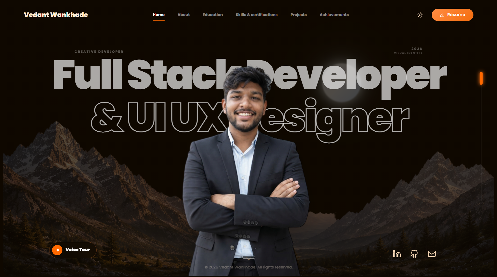

# Vedant Wankhade Portfolio



Personal portfolio for **Vedant Wankhade** — CSE B.Tech student, full-stack developer, and AI enthusiast.

Built with React, TypeScript, Vite, Framer Motion, GSAP, and Tailwind CSS v4.

## Features

- Full-viewport sections with smooth transitions
- Education timeline with academic history
- Skills, projects, and achievements showcase
- In-app resume preview with zoom and download
- Responsive mobile layout

## Stack

| Category | Technologies |
| :--- | :--- |
| Core | React 19, Vite 7, TypeScript |
| Styling | Tailwind CSS v4, Radix Slot |
| Motion | GSAP, Framer Motion |
| Icons | Lucide React, Devicon |

## Project structure

```text
├── public/
│   ├── images/
│   │   ├── achievements/   # Hackathon & award photos
│   │   ├── certificates/   # Certificate images
│   │   ├── marketing/      # README / OG images
│   │   ├── profile/        # Profile & hero stills
│   │   └── projects/       # Project thumbnails
│   ├── resume/             # PDF resume
│   ├── robots.txt
│   └── sitemap.xml
├── src/
│   ├── components/
│   │   ├── Portfolio.tsx   # Main portfolio UI
│   │   └── ui/             # Shared UI primitives
│   ├── data/
│   │   └── portfolio.ts    # Content & media paths
│   ├── lib/
│   ├── App.tsx
│   ├── index.css
│   └── main.tsx
├── package.json
├── vite.config.ts
└── netlify.toml
```

## Projects featured

1. **HealBook** — AI doctor booking & symptom chatbot (React, Gemini, Node)
2. **Ekdanta** — Client e-commerce storefront (React, Firebase)
3. **Engineering Project Hub** — Project marketplace (React, Framer Motion)
4. **Drawgit** — GitHub repo visualizer (Next.js, OpenAI)
5. **NeuCV** — AI resume builder (Vue, FastAPI)

## Getting started

```bash
pnpm install
pnpm dev
```

Open [http://localhost:5173](http://localhost:5173).

```bash
pnpm build    # output in /dist
pnpm preview  # preview production build
```

Deployed via Netlify (`netlify.toml` publishes `dist`).
