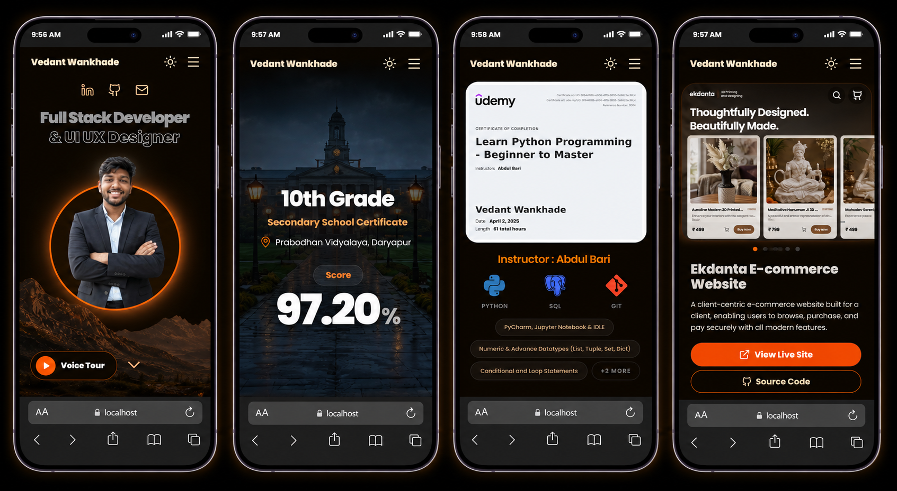

# Vedant Wankhade Portfolio


A modern, highly interactive, and visually premium personal portfolio website showcasing the skills, projects, education, and achievements of **Vedant Wankhade** — a CSE B.Tech student, Full-Stack Developer, and AI Enthusiast.

Built with **React**, **TypeScript**, **Vite**, **Framer Motion**, **GSAP**, and **Tailwind CSS v4**, this portfolio goes beyond a typical static resume website to offer a fully immersive, narrative, and interactive experience.

---

## 🌟 Key Features

*   🎙️ **Interactive Voice Tour**: Experience a guided tour of the portfolio with a real-time synchronized voice guide (`Voice-Tour.mp3`). The site automatically scrolls, opens modals, and displays a virtual clicking cursor synced directly to the timestamp of the voiceover.
*   🍱 **Bento-Grid Achievements Showcase**: A dynamic, masonry bento layout displaying certificates, competitive coding participations, and hackathon highlights (such as HackGenX 2026 and Codorithm 2K25). Images in each bento card cycle automatically to present a lively, interactive wall of accomplishments.
*   📈 **Interactive Education Timeline**: An engaging horizontal/vertical scrolling educational timeline detailing academic history from secondary school to the current B.Tech CSE degree, highlighting semester-by-semester CGPA details.
*   📑 **In-App Resume Previewer & Custom Zoom Drawer**: Allows visitors to preview the professional resume directly inside the browser in a customized window, equipped with real-time zooming controls (Zoom In/Out) and quick download links.
*   🌓 **Dynamic Theme System**: Seamless transitions between a modern deep dark theme and a clean, warm light theme.
*   ⚡ **GSAP & Framer Motion Animations**: Smooth page transitions, parallax layout elements, floating micro-interactions, and mouse-hover responsive elements.

---

## 📱 Responsive Mobile Design

The portfolio is designed with a mobile-first philosophy, featuring floating utility widgets for menu navigation, theme toggling, and quick resume downloads.



---

## 🛠️ Technology Stack

| Category | Technologies |
| :--- | :--- |
| **Core Framework** | React 19, Vite 7, TypeScript |
| **Styling** | Tailwind CSS v4, Radix UI primitives |
| **Animation Engines** | GSAP (GreenSock), Framer Motion, CSS Animate |
| **Icons** | Lucide React, Devicon (font-icons) |
| **Build & Tooling** | PNPM/NPM, Prettier, PostCSS, Shadcn/ui CLI |

---

## 📁 Project Structure

```text
├── public/                 # Static assets (images, audio files)
│   ├── images/             # Profile pictures, project thumbnails, achievements
│   └── Voice-Tour.mp3      # Audio file for the interactive tour guide
├── src/
│   ├── components/
│   │   ├── mockups/
│   │   │   └── portfolio/
│   │   │       └── Portfolio.tsx   # Core Portfolio page implementation
│   │   └── ui/             # Reusable custom UI components (Button, Input, etc.)
│   ├── lib/                # Utility helper functions
│   ├── App.tsx             # App router/loader setup
│   ├── index.css           # Global styles and Tailwind imports
│   └── main.tsx            # Main react mounting entrypoint
├── package.json            # Scripts and dependencies configuration
├── vite.config.ts          # Vite configuration with custom preview plugins
└── tsconfig.json           # TypeScript configuration
```

---

## 🚀 Showcased Projects

Here are the key projects featured inside the portfolio:

1.  **HealBook (AI-Powered Doctor Booking & Chatbot)**
    *   *Description*: An AI-driven appointment platform where patients can find doctors nearby. Features a voice-enabled Gemini AI symptom identification chatbot.
    *   *Stack*: React, Gemini API, Node.js, Tailwind CSS
2.  **Ekdanta E-Commerce Website**
    *   *Description*: A commercial online storefront built for a client, complete with product catalogs, shopping cart flows, and secure checkout.
    *   *Stack*: React, Firebase (Auth/Firestore/Hosting), Node.js, Tailwind CSS
3.  **Engineering Project Hub**
    *   *Description*: A dedicated marketplace for ordering customized academic and engineering projects, with interactive client request portals.
    *   *Stack*: React, Framer Motion, Tailwind CSS
4.  **Drawgit (Repository Visualizer)**
    *   *Description*: Transforms any public GitHub repository URL into an interactive visual node tree structure showing folders and file relations.
    *   *Stack*: Next.js, OpenAI, Tailwind CSS
5.  **NeuCV Resume Builder**
    *   *Description*: A modern resume generation tool offering AI suggestions for phrasing, formatting, and real-time template switching.
    *   *Stack*: Vue.js, Python, FastAPI

---

## 🔧 Getting Started

Follow these instructions to run the project locally on your machine.

### Prerequisites

*   **Node.js** (v18 or higher recommended)
*   **pnpm** (or `npm`/`yarn`)

### Installation

1.  **Clone the Repository**:
    ```bash
    git clone https://github.com/vedantwankhade123/Portfolio-Website.git
    cd Portfolio-Website
    ```

2.  **Install dependencies**:
    ```bash
    pnpm install
    # or npm install
    ```

### Running the Development Server

Start the local server for development:
```bash
pnpm dev
# or npm run dev
```
Open your browser and navigate to `http://localhost:5173`.

### Building for Production

Compile and bundle the site for deployment:
```bash
pnpm build
# or npm run build
```
The compiled output will be generated inside the `/dist` directory, ready to be served or deployed to hosts like Vercel, Netlify, or Firebase.
